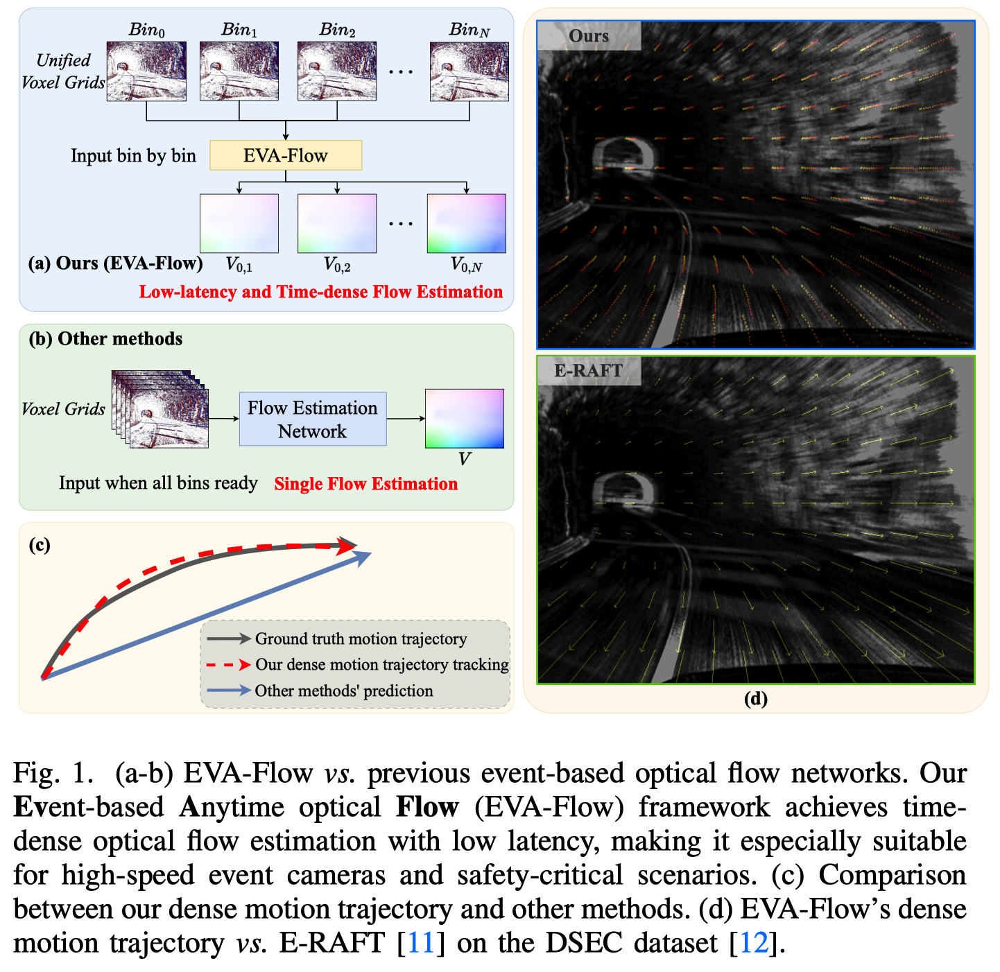

# EVA-Flow: Towards Anytime Optical Flow Estimation with Event Cameras
The official implementation code repository for [EVA-Flow: Towards Anytime Optical Flow Estimation with Event Cameras](https://arxiv.org/abs/2307.05033)




```
@misc{ye2023anytime,
      title={Towards Anytime Optical Flow Estimation with Event Cameras}, 
      author={Yaozu Ye and Hao Shi and Kailun Yang and Ze Wang and Xiaoting Yin and Yaonan Wang and Kaiwei Wang},
      year={2023},
      eprint={2307.05033},
      archivePrefix={arXiv},
      primaryClass={cs.CV}
}
```

## Environment

```bash
# create and activate conda environment
conda create -n anyflow python=3.9
conda activate anyflow

# install dependencies for hdf5
conda install blosc-hdf5-plugin=1.0.0 -c conda-forge
conda install pytables
pip install numba h5py hdf5plugin

# install pytorch, torchvision, tensorboard
# torch version: 1.12.1 or higher
# torchvision version: 0.13.1 or higher
pip install torch==1.12.1+cu116 torchvision==0.13.1+cu116 --extra-index-url https://download.pytorch.org/whl/cu116
pip install tensorboard

# imageio depends on freeimage
sudo apt install libfreeimage-dev
# install dependencies for others
pip install tqdm imageio opencv-python pyyaml matplotlib
```

## Dataset

### DSEC Dataset

1.Download the DSEC dataset. Dataset Structure is as follows:

```text
├── DSEC
    ├── Test
    │   ├── test_calibration
    │   │   ├── interlaken_00_a
    │   │   ├── interlaken_00_b
    │   │   ├── ...
    │   ├── test_events
    │   │   ├── interlaken_00_a
    │   │   ├── interlaken_00_b
    │   │   ├── ...
    │   └── test_forward_optical_flow_timestamps
    └── Train
        ├── train_calibration
        │   ├── interlaken_00_c
        │   ├── interlaken_00_d
        │   ├── ...
        ├── train_events
        │   ├── interlaken_00_c
        │   ├── interlaken_00_d
        │   ├── ...
        └── train_optical_flow
            ├── thun_00_a
            ├── zurich_city_01_a
            ├── ...
```

2. Generate distortion maps for DSEC dataset

```bash
python ./utils/gen_dist_map.py -d 'path/to/dataset/DSEC'
```